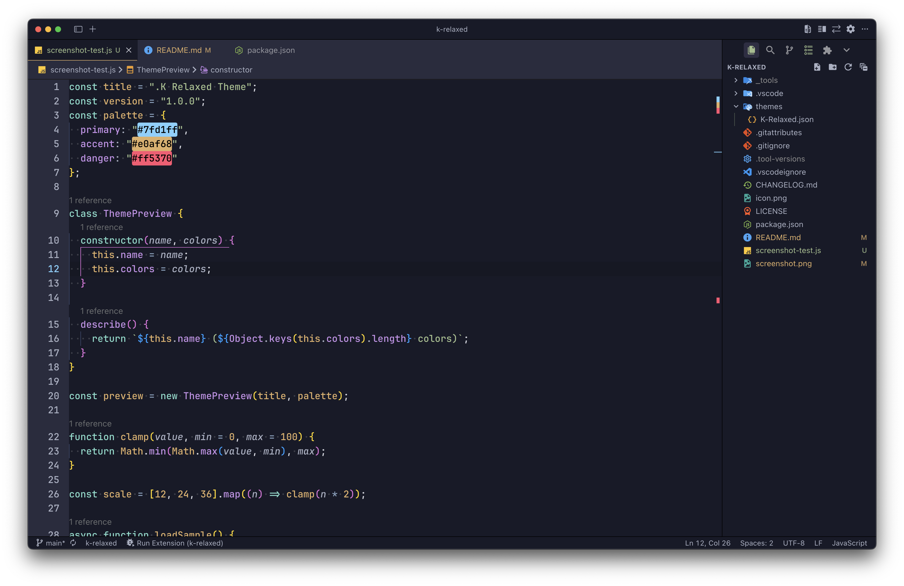

# .K Relaxed - VSCode Theme

A relaxed dark theme for Visual Studio Code. 
.**K Relaxed** provides a calm, eye-friendly color scheme optimized for long coding sessions.

## Installation

### Via VS Code Extensions Marketplace

1. Open VS Code
2. Go to Extensions view (`Ctrl+Shift+X` / `Cmd+Shift+X`)
3. Search for ".K Relaxed"
4. Click Install

### Via Command Line (VS Code)

For Visual Studio Code (Microsoft Marketplace):

```bash
code --install-extension tarikkavaz.k-relaxed
```

### Via Open VSX Registry

For VSCodium or other VS Code forks using Open VSX Registry:

```bash
codium --install-extension tarikkavaz.k-relaxed
```

Or using the `ovsx` CLI tool:

```bash
ovsx install tarikkavaz.k-relaxed
```

### Download Links

- [**VS Code Marketplace**](https://marketplace.visualstudio.com/items?itemName=tarikkavaz.k-relaxed)
- [**Open VSX Registry**](https://open-vsx.org/extension/tarikkavaz/k-relaxed)

---

## Screen Shot



## Contributing

Contributions are welcome! Here's how you can help:

1. **Fork the repository** and create your feature branch (`git checkout -b feature/AmazingFeature`)
2. **Make your changes** following the existing code style
3. **Test your changes** on multiple platforms if possible
4. **Commit your changes** with clear commit messages (`git commit -m 'Add some AmazingFeature'`)
5. **Push to the branch** (`git push origin feature/AmazingFeature`)
6. **Open a Pull Request**

### Development Setup

1. Clone the repository
2. Install dependencies: `npm install`
3. Open the folder in VS Code
4. Press `F5` to open a new Extension Development Host window
5. Make changes and test in the development window

### Reporting Bugs

Please use the [GitHub Issues](https://github.com/tarikkavaz/k-relaxed-theme/issues) page to report bugs. Include:

- VS Code version
- Operating system
- Extension version
- Steps to reproduce
- Expected vs actual behavior

## Support

- **Issues**: [GitHub Issues](https://github.com/tarikkavaz/k-relaxed-theme/issues)
- **Repository**: [GitHub Repository](https://github.com/tarikkavaz/k-relaxed-theme)

If you find this extension helpful, please consider giving it a star on GitHub!

## License

MIT